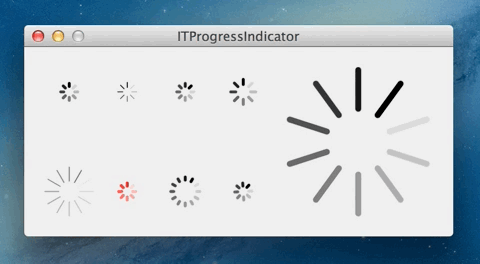

ITProgressIndicator
===================

A replacement class for `NSProgressIndicator` driven by Core Animation.
It's highly customisable and much more efficient than `NSProgressIndicator`.

`ITProgressInidicator` was created for [Play by Play](http://playbyplayapp.com), development funded by [David Keegan](http://davidkeegan.com).




Usage
-----

### Copy files

Copy the following files:

* `ITProgressIndicator.h`
* `ITProgressIndicator.m`

Make sure to copy them to the project, and to add them to the target.


### Use in a project

Make sure to check out the sample project.
Simply drag a custom view onto your window and set it's custom class to `ITProgressIndicator`.

It's advised to embed your progress indicator into a layer-backed view!
Look at the demo application for clarifaction.

To customise your progress indicator, use the following properties:

``` objc
/// @property isIndeterminate - Indicates if the view will show the progress, or just spin
@property (nonatomic, setter = setIndeterminate:) BOOL isIndeterminate;

/// @property progress - The amount that should be shown when `isIndeterminate` is set to `YES`
@property (nonatomic) CGFloat progress;

/// @property animates - Indicates if the view is animating
@property (nonatomic) BOOL animates;

/// @property hideWhenStopped - Indicates if the view will be hidden if it's stopped
@property (nonatomic) BOOL hideWhenStopped;

/// @property lengthOfLine - The length of a single line
@property (nonatomic) CGFloat lengthOfLine;

/// @property widthOfLine - The width of a single line
@property (nonatomic) CGFloat widthOfLine;

/// @property numberOfLines - The number of lines of the indicator
@property (nonatomic) NSUInteger numberOfLines;

/// @property innerMargin - The distance of the lines from the middle
@property (nonatomic) CGFloat innerMargin;

/// @property animationDuration - Duration of a single rotation
@property (nonatomic) CGFloat animationDuration;

/// @property gradualAnimation - Defines if the animation is smooth or gradual
@property (nonatomic) BOOL steppedAnimation;

/// @property color - The color of the progress indicator
@property (nonatomic, strong) NSColor *color;
```

You can also override the following method to achieve your own custom animation:

```objc
/**
 *  Override this method to achieve a custom animation
 *
 *  @return CAKeyframeAnimation - animation which will be put on the progress indicator layer
 */
- (CAKeyframeAnimation *)keyFrameAnimationForCurrentPreferences;
```
